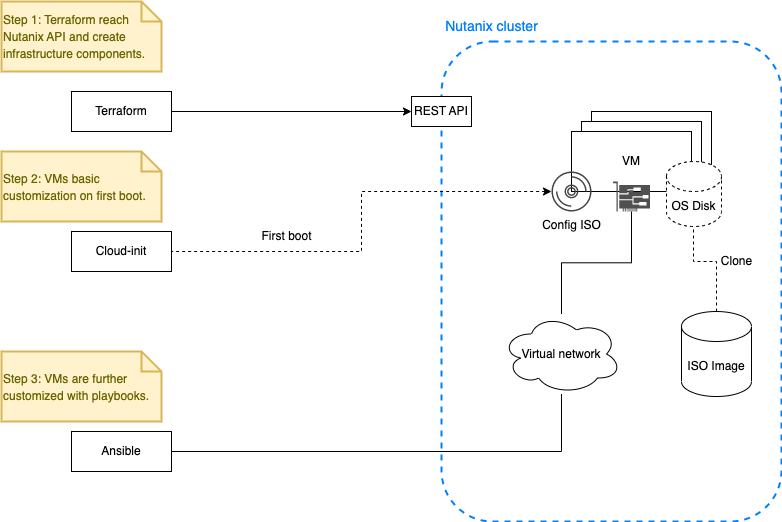

# Nutanix_IaC_lab
Infrastructure deployment with Terraform and Ansible

The code will take care of create the following resources in the Nutanix cluster: 
+ Nutanix image (preferably with a Linux generic cloud image). 
+ IPAM Subnet 
+ and a group of VMs; 

Will also create the ansible inventory file and execute ```test_pb.yml``` playbook against all VMs. After infrastructure is deployed other playbooks can be run with ```ansible-playbook```.

## Instructions

Clone the GIT repository and update values in ```terraform.tfvars```.

Change to ```terraform``` directory and run:

```shell
$ terraform init
$ terraform plan
$ terraform apply
```

## Deployment workflow



## Prerequisites

Terraform and Ansible must be installed in the control server where the code is executed.